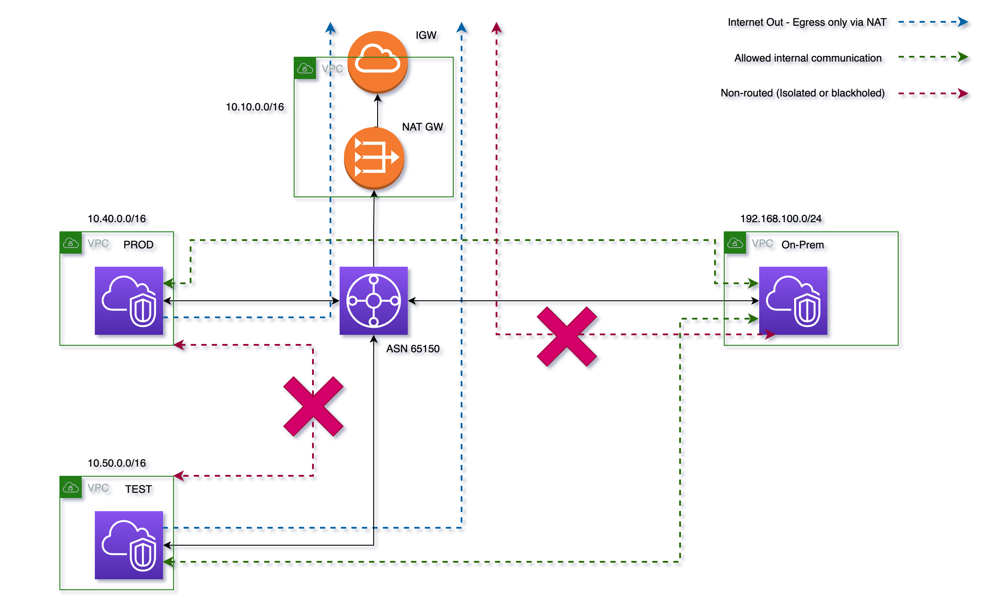

# AWS Central Egress with Terraform

As part of my studies for the AWS ANS-C01 I wanted to come up with a central egress solution which blocked and isolated certain pathings. 

Following on from completing the exam, I wanted to work on my IaC skills. With that in mind, I went ahead and done just that with my previous scenario, but made up in Terraform.  

Feel free to use and edit it as you please. 

## What this will generate:
- 1 Transit Gateway with attachments to each VPC in 2 AZ's and relevant routes required, appliance mode enabled for egress.
- 4 VPCs, each with their subnets in 2 AZs, Public subnets where required and route tables for those.
- 2 NAT GWs, 1 in each AZ in the egress VPC.
- 3 EC2 instances, T3.micro, in; Prod, Test and On-Prem VPCs.
- Security Groups allowing a blanket "access everything anywhere".
- 2 IGWs, 1 in egress and On-Prem VPCs

## What should happen
- Prod and Test VPCs cannot communicate with eachother due to a blackhole route in the TGW RTB that serves those VPCs
- Prod and Test VPCs can communicate with the internet via the NATGWs, and can communicate with OnPrem.
- OnPrem VPC can communicate with VPC Prod and Test.

## Notes:
- For use in eu-west-2 due to the AMI IDs. Feel free to change it and have a play.
- Will take about 3-4 minutes to completely spin up, mostly due to the NAT GWs and TGW. 
- Will be cleaned up in the near future. 
- I'm not liable for your misery around the costs of the NAT Gateways.... 
